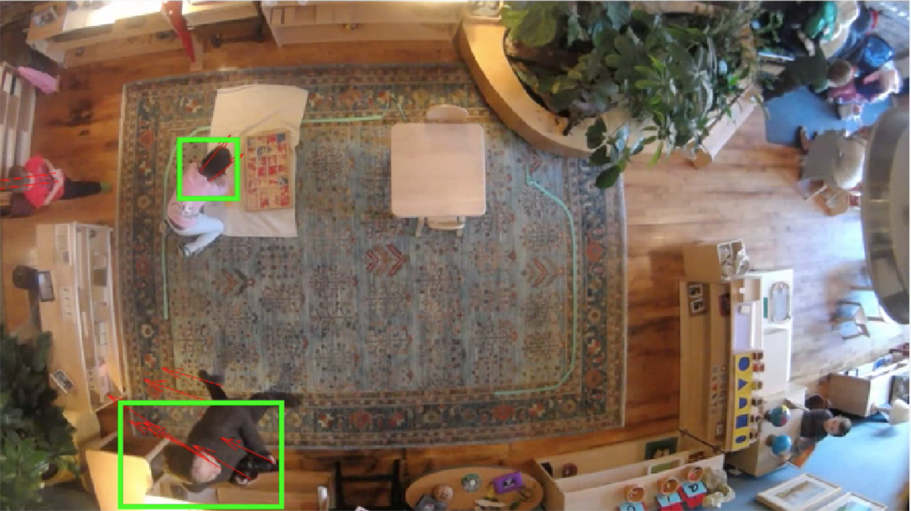

# Preschool Classroom Person Tracker
Final Project for Advances in Computer Vision (6.869 at MIT)

See paper_submission.pdf for an outline of the project's background, development process, and results.

In this project, I devise a set of algorithms that utilize motion-based tracking techniques to create compelling visualizations such as a dynamic heat maps of people's physical location and movement. The algorithms are loosely based on the Kalman filter and Lucas-Kanade methods. The performance of the algorithms is demonstrated using our lab's recordings of students and teachers from ceiling-mounted webcams in Montessori school classrooms. The objective is to use the data to report meaningful information about the students' habits in the schools by creating visualizations that would help teachers better understand how the physical space is utilized.

## Code

* multiObjectTracking.m is a slightly modified version of this Matlab example: http://www.mathworks.com/help/vision/examples/motion-based-multiple-object-tracking.html. 
* lucasKanadeCentroids.m is the algorithm that uses Lucas Kanade method to find clusters of optical flow vectors, and places a marker on the centroid of the cluster vectors.
* lucasKanadeBounding.m is the algorithm that uses Lucas Kanade method to create bounding boxes around every optical flow vector, and merges overlapping bounding boxes to construct a final bounding box for each tracked subject in the frame.

The .mat files contain results obtained using these scripts, which we utilized when constructing the graphs located in the "figures" directory.

Two demo videos are attached: mutliple_people and one_person, which can be used with any of the scripts attached to recreate the visual representations discussed in the paper.
